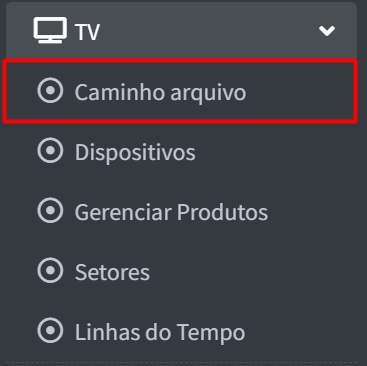

# Caminho do Arquivo

## O que seria o caminho do arquivo?

A opção **"Caminho Arquivo"** é usada quando a TV **não possui integração com nosso CRM** ou **não há integração com o sistema ERP do cliente**.  
Nesses casos, os produtos são enviados para a TV por meio de um **arquivo gerado pela balança**.
Esse campo deve ser utilizado como uma **solução alternativa**, permitindo que o sistema localize o arquivo de produtos no **caminho do servidor informado**.  
A partir disso, nosso sistema realiza a **leitura do arquivo e exibe os produtos corretamente na TV**, mesmo sem uma integração direta.

## Relação de aparelhos

### Mostrar e Buscar

Nesta tela de **Relação de Aparelhos**, é possível visualizar as configurações de cada loja, como o caminho do arquivo e o nome do arquivo que está sendo usado.

- A opção **“Mostrar 10 resultados”** permite definir quantas lojas aparecem por página.  
  Caso o usuário deseje, pode alterar esse número para exibir **todas as lojas em uma única página**.
- Já o campo **“Buscar”** serve para **localizar rapidamente uma loja específica** digitando parte do nome ou número.  
  Isso facilita a navegação em situações com muitas lojas cadastradas.

---

### Código e Loja

A coluna **“Loja”** exibe a identificação de cada unidade cadastrada no sistema.  
O número antes do nome representa o **código interno da loja**, utilizado para organização e controle.

Ao lado do código, aparece o **nome da loja**, facilitando a localização e a gestão individual de cada unidade.

Essa identificação é importante para garantir que o caminho do arquivo e o nome do arquivo estejam corretamente associados a cada loja específica.

---

### Caminho

A coluna **“Caminho”** mostra **onde o arquivo está salvo dentro do computador da loja**.  
Esse caminho precisa estar certinho, pois é por ele que o sistema vai **encontrar o arquivo** que será exibido na TV.

---

### Arquivo

A coluna **“Arquivo”** mostra o **nome do arquivo** que o sistema vai ler dentro do caminho indicado.  
Esse arquivo é o que contém a **lista de produtos que serão exibidos na TV**.

O nome mais comum usado é `itensmgv.txt`, mas pode variar dependendo de como a loja ou a balança gera esse arquivo.  
É importante que o nome esteja **correto e igual ao nome real do arquivo** que está salvo na pasta, senão o sistema **não consegue encontrar e exibir os produtos**.

